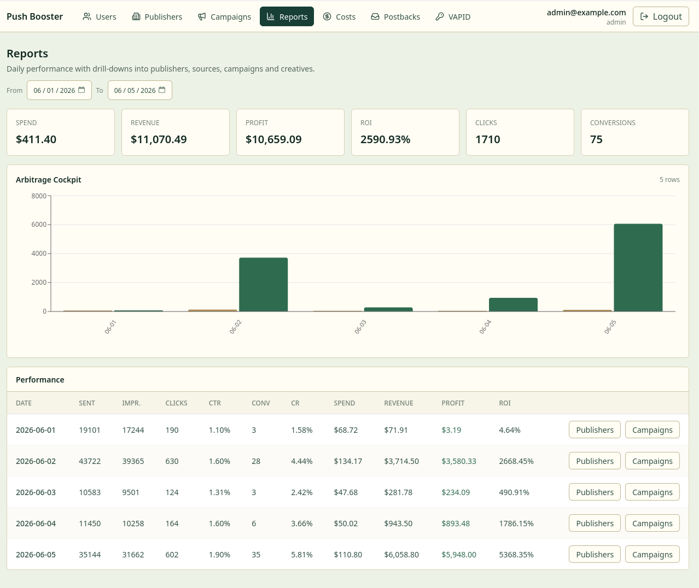

# Push Booster

Push Booster is a source-available web-push traffic platform for internal operator teams and media buyers. It combines publisher/source inventory, browser subscription collection, ClickHouse analytics, Redpanda delivery queues, Redis caps/state and sender workers.

The current codebase is alpha software. It is intended for local evaluation, architecture review and self-hosted internal use.



## License

This repository is licensed under the Push Booster Source-Available License 1.0.

You may self-host Push Booster for yourself or your organization, including revenue-generating use with your own traffic. You may not sell Push Booster itself, provide hosted/SaaS access, white-label it, resell it, or build a competing commercial product based on it without a separate written commercial license.

This is not an OSI-approved open-source license because it restricts productization, resale and hosted commercial offerings.

## What Works

- Email OTP admin login.
- Publisher and subscription source management.
- Source-aware VAPID key management and snippet generation.
- Public SDK config, subscribe endpoint and service-worker event ingestion.
- Subscriber, event and analytics storage in ClickHouse.
- Campaigns, creatives, targeting rules, audience estimates and launch enqueueing.
- Redpanda delivery task streaming and sender workers.
- Payload decisioning with Redis trigger context and caps.
- Postback ingestion, cost import and performance reports.

## Architecture

- PostgreSQL: operational relational data.
- ClickHouse: subscribers, events, audience snapshots and analytics.
- Redpanda: delivery task streaming.
- Redis: caps, idempotency, trigger context, locks and short-lived state.
- Go services: admin API, public API, payload API, scheduler, sender and migrators.
- React admin frontend: internal operator UI.

Primary docs:

- [PUSH_BOOSTER_SPEC.md](PUSH_BOOSTER_SPEC.md)

## Requirements

- Go matching [go.mod](go.mod).
- Node.js 20+ and npm.
- Docker with Docker Compose.
- A browser with Web Push support for the demo subscription flow.

## Quickstart

Start infrastructure:

```sh
make infra-up
```

Apply migrations:

```sh
make migrate-up
make migrate-clickhouse
```

Optionally seed demo data:

```sh
make dev-seed
```

Run the backend services in separate terminals:

```sh
AUTH_DEV_RETURN_OTP=true AUTH_ADMIN_EMAIL=admin@example.com make admin-api
make public-api
make payload-api
make sender
make scheduler
```

Run the admin frontend:

```sh
make admin-frontend
```

Open the Vite URL, usually `http://localhost:5173`, and log in as `admin@example.com`. In local mode the OTP is returned by the API and shown by the login form.

## Demo Flow

1. Create a publisher.
2. Create a subscription source with the demo domain.
3. Generate or attach a VAPID key.
4. Open the source snippet from the Sources page.
5. Use the demo subscribe page to grant push permission.
6. Verify source stats in the admin UI.
7. Create a campaign and creative.
8. Estimate/build an audience and enqueue a launch.
9. Run `sender` to consume delivery tasks.

## Configuration

Copy [.env.example](.env.example) when you want a local reference for environment variables:

```sh
cp .env.example .env
```

The Makefile and services already include local defaults. Do not reuse the default passwords, JWT secret or VAPID keys in production.

Useful local ports:

- Admin API: `http://localhost:8080`
- Public API: `http://localhost:8082`
- Payload API: `http://localhost:8083`
- Admin frontend: `http://localhost:5173`
- Redpanda Console: `http://localhost:8081`
- PostgreSQL: `localhost:5432`
- ClickHouse: `http://localhost:8123`
- Redis: `localhost:6379`

## Common Commands

```sh
make test
npm --prefix apps/admin-frontend run lint
npm --prefix apps/admin-frontend run build
make build-admin-api
make build-public-api
make build-payload-api
make build-sender
make build-scheduler
```

Generate VAPID keys:

```sh
make vapid-keys
```

Health checks:

```sh
curl http://localhost:8080/healthz
curl http://localhost:8080/readyz
```

## Known Limitations

- Alpha-stage codebase; APIs and schema may change.
- Not production-hardened for public multi-tenant SaaS.
- No billing, marketplace, white-label or self-service tenant onboarding.
- Some alpha compatibility paths remain, including temporary trigger fallbacks documented in the spec.
- Local Docker Compose uses default credentials and exposed service ports.

## Security

See [SECURITY.md](SECURITY.md). Please do not publish vulnerability details before maintainers have had time to respond.
